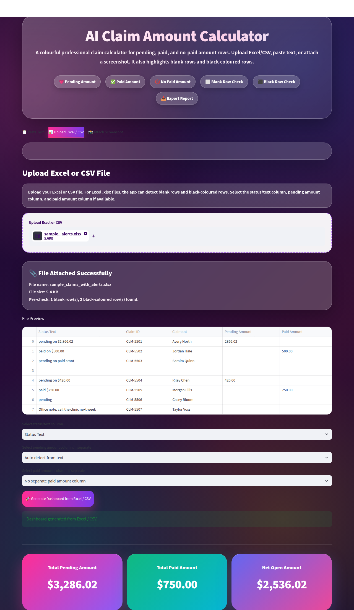

# ai-claim-amount-calculator

## Try it with sample data

Fictional claim files are in `samples/`. The names and claim IDs are made up.

```bash
python -m pip install -r requirements.txt
streamlit run app.py
```

Open **Upload Excel / CSV** and upload a sample. `Status Text` is the first column, so leave the dropdowns on their defaults (`Status Text`, **Auto detect from text**, and **No separate paid amount column**). Click **Generate Dashboard from Excel / CSV**.

| File | What you should see |
| --- | --- |
| `samples/sample_claims.csv` | Pending total **$3,125.27**, paid total **$1,500.00**, and one blank row. CSV files do not store row colour, so the black-row count stays at zero. |
| `samples/sample_claims_with_alerts.xlsx` | Pending total **$3,286.02**, paid total **$750.00**, one blank row, and two black-row alerts. Excel row 6 is solid black (`pending on $420.00`). Excel row 7 is dark (`paid $250.00`). |

`Pending Amount` and `Paid Amount` are optional numeric columns. Selecting those instead of auto-detect produces the same totals.

The Excel sample, after you generate the dashboard:


